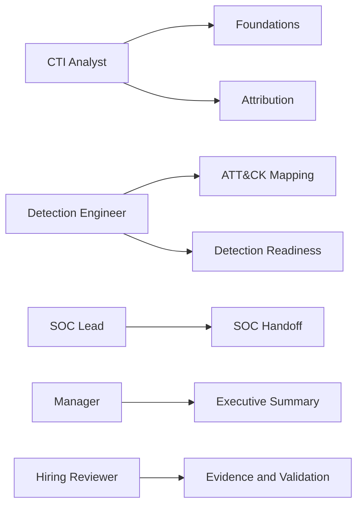

# Role-Based Reading Paths

## Purpose

Give different reviewers a direct path through the manual without forcing them to read every page linearly.

## CTI Analyst Path

1. [What Is CTI](01-cti-foundations/what-is-cti.md)
2. [PIR, SIR, and EEI](01-cti-foundations/pir-sir-eei.md)
3. [Evidence Labels](01-cti-foundations/evidence-labels.md)
4. [Source Reliability](01-cti-foundations/source-reliability.md)
5. [Assumptions and Gaps](02-analytic-discipline/assumptions-and-gaps.md)
6. [Attribution Methodology](04-attribution/attribution-methodology.md)
7. [Actor Profile Template](06-actor-research/actor-profile-template.md)
8. [Finished Intelligence Report Template](10-templates/finished-intel-report-template.md)

## Detection Engineer Path

1. [MITRE ATT&CK as a Working Tool](03-frameworks/mitre-attack-as-working-tool.md)
2. [ATT&CK Mapping Mistakes](03-frameworks/attck-mapping-mistakes.md)
3. [Intelligence to Detection](08-cti-to-detection/intelligence-to-detection.md)
4. [Telemetry Requirements](08-cti-to-detection/telemetry-requirements.md)
5. [Detection Backlog](08-cti-to-detection/detection-backlog.md)
6. [Detection Readiness Levels](08-cti-to-detection/detection-readiness-levels.md)
7. [SOC Handoff](08-cti-to-detection/soc-handoff.md)
8. [Israel Threat Actors CTI Detection Dashboard](https://anpa1200.github.io/israel-government-threat-actors-cti/detection-status-dashboard/)

## SOC Lead Path

1. [Intelligence Cycle](01-cti-foundations/intelligence-cycle.md)
2. [Hunting Hypothesis Template](08-cti-to-detection/hunting-hypothesis-template.md)
3. [SOC Handoff](08-cti-to-detection/soc-handoff.md)
4. [Detection Readiness Levels](08-cti-to-detection/detection-readiness-levels.md)
5. [Customer-Driven AI CTI Workflow](https://anpa1200.github.io/customer-driven-ai-cti-project/docs/workflow/full-workflow-quick-reference/)
6. [Limitations](limitations.md)

## Manager / Executive Path

1. [Intro](intro.md)
2. [Finished Intelligence vs Research Notes](01-cti-foundations/finished-intelligence-vs-research-notes.md)
3. [Confidence Language](01-cti-foundations/confidence-language.md)
4. [Executive Summary Template](10-templates/executive-summary.md)
5. [Ecosystem](ecosystem.md)
6. [Known Limitations](limitations.md)

## Hiring Reviewer Path

1. [Publication-Grade Review Backlog](review/publication-grade-review.md)
2. [Authoritative Bibliography](references/authoritative-bibliography.md)
3. [Module Worked Examples](worked-examples/cti-foundations.md)
4. [Detection Readiness Levels](08-cti-to-detection/detection-readiness-levels.md)
5. [AI CTI Control Matrix](09-ai-assisted-cti/ai-cti-control-matrix.md)
6. [Cross-Project Correlation Register](governance/cross-project-correlation-register.md)
7. [CI Validation Evidence](validation/ci-validation-evidence.md)

## Diagram

## Cross-Links

- [CTI Project Ecosystem](ecosystem.md)
- [Fact Correlation](fact-correlation.md)
- [Customer-Driven AI CTI Project](https://anpa1200.github.io/customer-driven-ai-cti-project/)
- [Israel Government Threat Actors CTI](https://anpa1200.github.io/israel-government-threat-actors-cti/)
